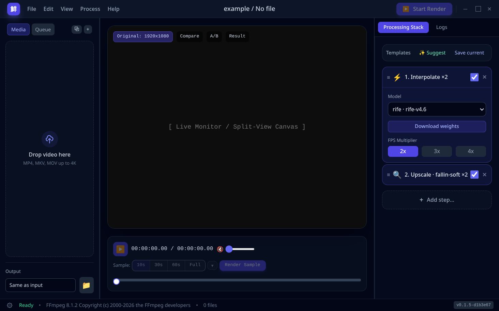
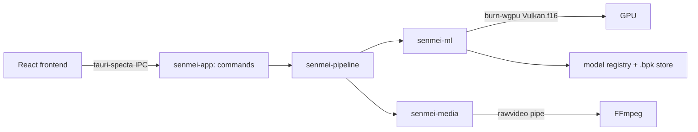
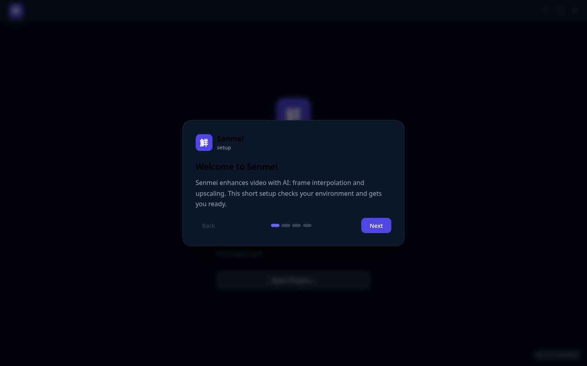
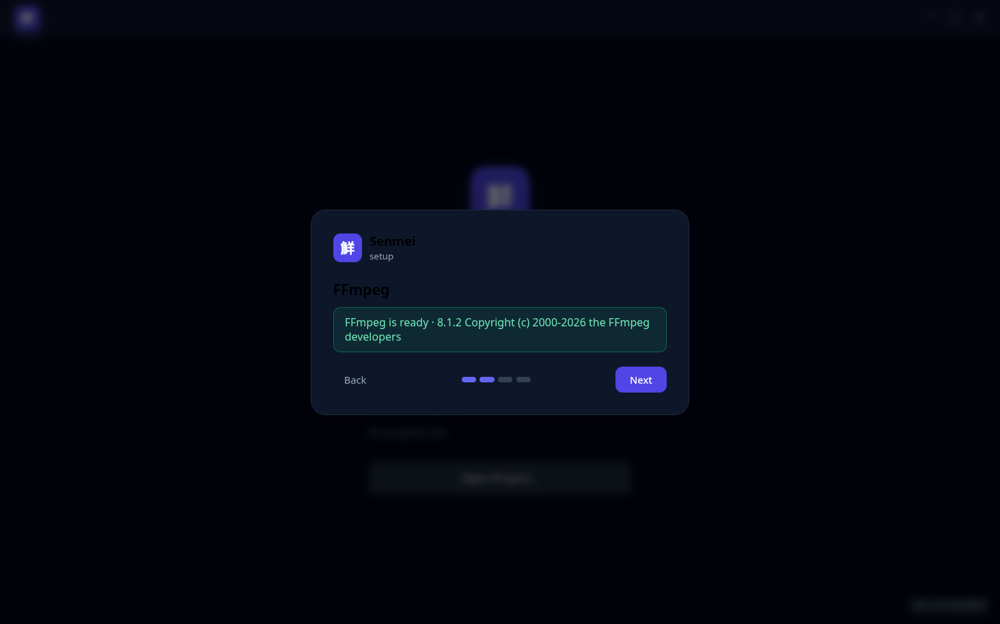
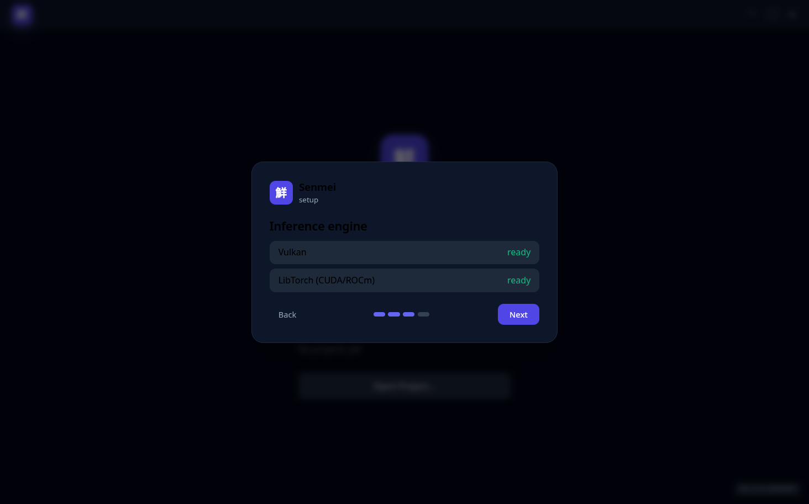
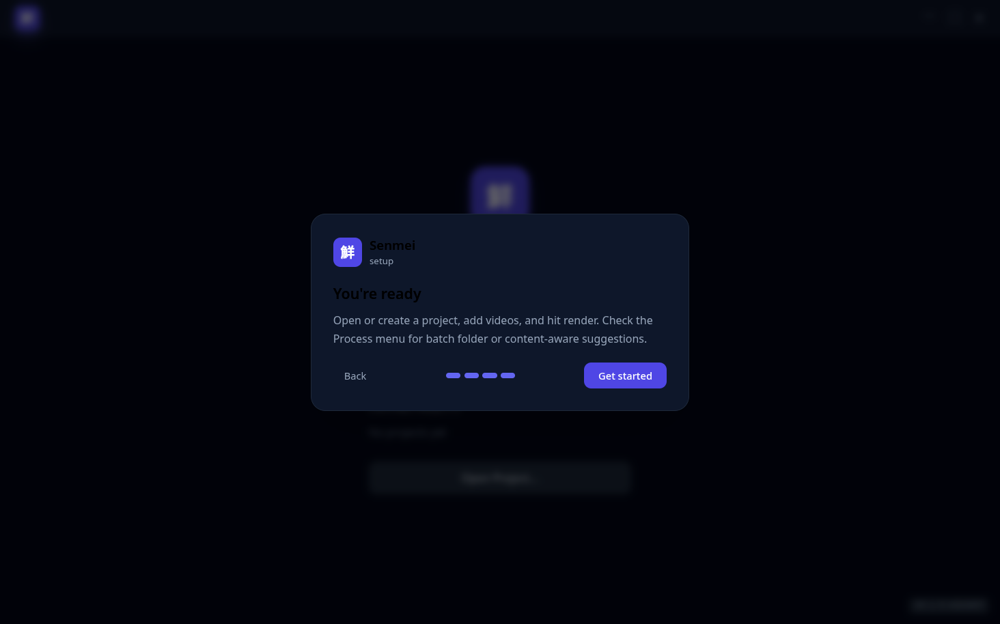
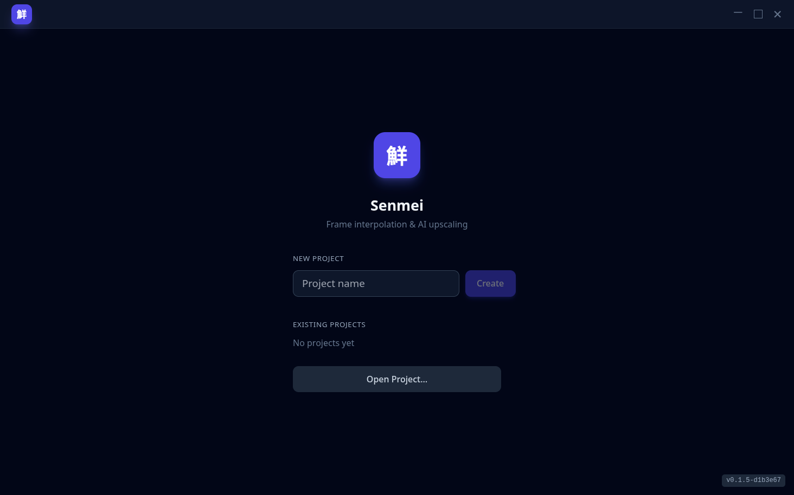

# Senmei (鮮明)

**Senmei** (Japanese for "clear, vivid, distinct") is a modern desktop video
enhancer in Rust — AI upscaling, frame interpolation, denoising and deblurring,
modeled after [REAL Video Enhancer](https://github.com/TNTwise/REAL-Video-Enhancer).

Built as a clean-room **burn** port: every model architecture is re-implemented
from a permissively-licensed reference (no TorchScript/ONNX Runtime at runtime)
and runs on **Vulkan fp16**.

<p align="center">
  
</p>

> **Status:** pre-alpha — works daily, expect rough edges. macOS is experimental.

## Features

- **ML processing stack** — composable steps, applied per frame:
  **Upscale** (Real-CUGAN, Real-ESRGAN, Fallin, 4x_Alchemy, BSRGAN),
  **Interpolate** (RIFE v4.6, IFRNet), **Denoise** (DRUNet), **Deblur** (NAFNet),
  plus reference CPU steps (dedup, resize, unsharp fallbacks).
- **Timeline & samples** — in/out range, "Render Sample", compare/result views.
- **Batch queue** — render many files, pause/resume/cancel, per-file progress.
- **FFmpeg pipeline** — codec-agnostic decode, LGPL-safe encoders
  (libkvazaar / libopenh264 / SVT-AV1), audio passthrough, HDR→SDR tonemapping.
- **Download-on-demand models** — weights are never bundled; the app fetches and
  converts them to f16 `.bpk` burnpacks (sha256-pinned, license-gated).

## Tech stack

| Layer | Choice |
|---|---|
| UI host | Tauri 2 + platform webview (webkit2gtk / WebView2 / WKWebView) |
| Frontend | React + TypeScript + Vite · bun · Base UI + Tailwind + lucide-react |
| Inference | burn (`burn-wgpu`) · **Vulkan, fp16** (default) · optional **LibTorch** backend (`tch` feature, runtime-dlopen, CUDA/ROCm) |
| Media | FFmpeg as subprocess (`rawvideo` pipe), system or portable LGPL build |
| License | MIT OR Apache-2.0 |

## Architecture



- `crates/senmei` — Tauri shell (config, main, logging)
- `crates/senmei-app` — Tauri commands, state, IPC, typed bindings
- `crates/senmei-pipeline` — step orchestration, batch queue, events
- `crates/senmei-ml` — `InferenceEngine`, `BurnEngine`, burn archs, registry
- `crates/senmei-media` — FFmpeg decode/encode, probe, preview, downloader
- `packages/app` / `packages/ui` — React frontend + shared UI kit
- `packages/bridge` — generated TS types (tauri-specta)

## Installation

Prebuilt bundles are published per version tag on
[GitHub Releases](https://github.com/senmei-app/senmei/releases) — Linux,
Windows and macOS (see [docs/RELEASING.md](docs/RELEASING.md) for what CI
builds). Models are **never bundled**: the app downloads them on demand from
the Processing Stack (step → **Download weights**), sha256-pinned and
license-gated; downloaded files are managed in Settings → Models.

FFmpeg: system FFmpeg is preferred; on Linux/Windows the app falls back to a
portable **LGPL** build (macOS uses system FFmpeg only).

## System requirements

- **GPU:** Vulkan-capable (fp16 recommended); a CPU fallback exists for all
  models.
- **OS:** Linux (webkit2gtk) · Windows (WebView2) · macOS (WKWebView,
  experimental).
- **VRAM:** tiling keeps memory bounded, so even large frames (4K+) work on
  mid-range cards; more VRAM speeds up bigger resolutions.
- **Optional LibTorch backend** (CUDA/ROCm): ⚠️ on **AMD RDNA4 + ROCm** this
  path can GPU-hang/reset the desktop — prefer the default Vulkan backend on
  AMD and enable tch only if you know what you're doing.

## First run

The first launch walks you through setup in a short wizard (four screens):

<p align="center">
  
  
</p>
<p align="center">
  
  
</p>

Then create a project (or open an existing one) and you're in the main window
(hero screenshot at the top):

<p align="center">
  
</p>

1. **Create or open a project** — name one and hit Create.
2. **Add a video** — drag it onto the Media panel (MP4/MKV/MOV up to 4K).
3. **Build your processing stack** — enable steps like *Interpolate ×2* or
   *Upscale ×2*; pick a model and hit **Download weights** if it isn't local.
4. **Render** — process a short sample or the full range.

## FAQ

- **No Vulkan GPU?** — every model has a CPU fallback (slower, but works).
- **Model download fails?** — weights come from GitHub Releases over HTTPS,
  sha256-pinned; check your connection and retry (Settings → Models).
- **AMD RDNA4 + ROCm?** — stick with the default Vulkan backend; the optional
  LibTorch/ROCm path can GPU-reset the desktop on RDNA4 (see System
  requirements).
- **What does "pre-alpha" mean?** — it works daily for the author, but expect
  rough edges; macOS is experimental.
- **What do I get as output?** — LGPL-safe encodes: HEVC (libkvazaar), H.264
  (libopenh264) or AV1 (SVT-AV1), with audio passthrough.

## Quickstart (from source)

```sh
bun install          # frontend deps
bun run dev          # full app: cargo tauri dev (Vite + Rust, hot reload)
bun run ui:dev       # frontend only
```

Models download on first use (Processing Stack → step → "Download weights").
To convert a model manually: `cargo run -p senmei-ml --features burn --bin
senmei-ml-convert -- <arch> <model.pth|onnx> <out.bpk> [scale] [num_block]`.

## Model zoo

See [`docs/models.md`](docs/models.md) for the full matrix (adopted, backlog,
licenses, sources). Every model is torch-verified against the port before it is
marked loadable; weights are recorded per artifact with license + source.

## For developers

User-facing docs live in this README; the repo keeps one truth per fact —
cross-reference, don't duplicate. New decision → `PLAN.md`;
model added → `models.md` (numbers → `benchmarks.md`); upstream bug →
`upstream-issues.md`; implemented work →
`CHANGELOG.md`; still open → `todos.md`.

- [`docs/PLAN.md`](docs/PLAN.md) — decisions & architecture (source of truth)
- [`docs/models.md`](docs/models.md) — model matrix & backlog
- [`docs/benchmarks.md`](docs/benchmarks.md) — perf numbers
- [`docs/upstream-issues.md`](docs/upstream-issues.md) — upstream burn/cubecl findings + paste-ready texts
- [`docs/RELEASING.md`](docs/RELEASING.md) — how to cut a release
- [`docs/CHANGELOG.md`](docs/CHANGELOG.md) — implementation log (newest on top)
- [`docs/todos.md`](docs/todos.md) — open backlog only

## License

Own code dual-licensed under **MIT OR Apache-2.0** (details in
[`docs/PLAN.md`](docs/PLAN.md), section 14). FFmpeg is only ever used as an
**LGPL** build; model weights carry their own permissive licenses (recorded in
`docs/models.md`).
