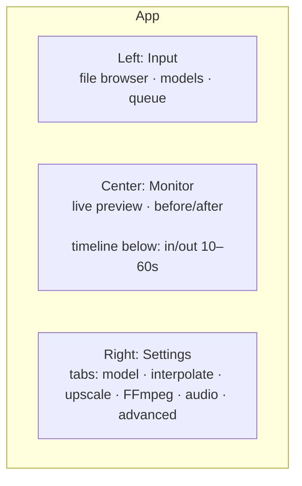
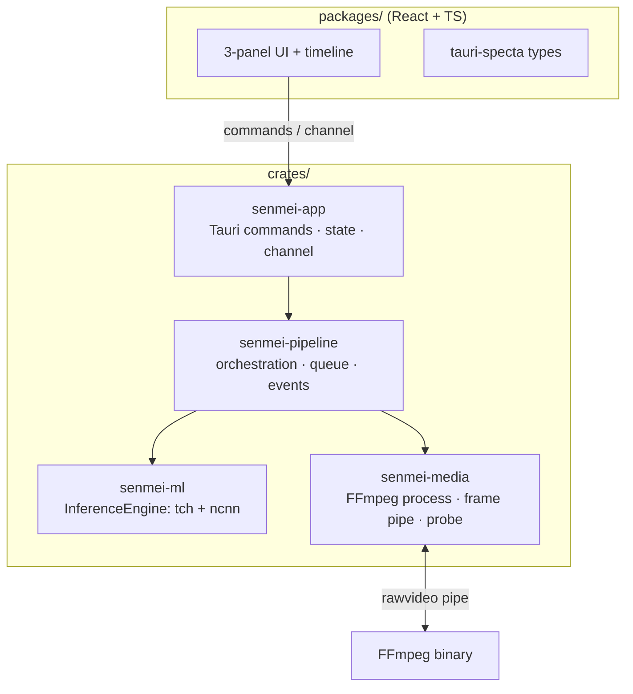
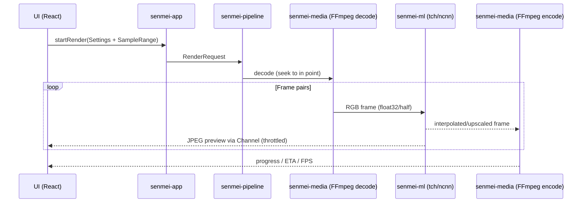

# Senmei — Implementation Plan

> Rust re-implementation of a video enhancer modeled after REAL Video Enhancer (RVE).
> **Senmei (鮮明)** — GitHub: [senmei-app](https://github.com/senmei-app)
> GUI concept inspired by [Koharu](https://github.com/mayocream/koharu) and VS Code.

---

## 0. Vision

A fast, modern desktop video enhancer in Rust with:

- **Frame interpolation** (e.g. 24 → 48 fps) and **upscaling** (e.g. 1080p → 4K)
- **Multi-backend GPU inference**: libtorch (CUDA / ROCm / MPS / possibly XPU) + NCNN/Vulkan
- **Consistent HTML/CSS/JS UI** via CEF on Windows/Linux/macOS
- **Better FFmpeg settings** than RVE (profile-based, extensible, validated)
- **Sample preview** of 10–60 s directly in the app

---

## 1. Agreed Decisions

| # | Topic | Decision |
|---|---|---|
| 1 | Shell / UI host | **Tauri 2 + CEF** (`tauri::Cef`), not raw `cef-rs` |
| 2 | Frontend | **React + TypeScript**, `react-resizable-panels`, Tailwind, lucide-react |
| 3 | Inference | **libtorch** (`tch` crate, own wrapper as fallback) + **NCNN/Vulkan** |
| 4 | No ONNX Runtime | all models run via libtorch or NCNN |
| 5 | No WebGPU/WASM | preview via `<video>` + 2D canvas (Chromium-native) |
| 6 | Media | **FFmpeg as subprocess** with `rawvideo` pipe |
| 7 | Layout | **3-panel + timeline**: Input \| Monitor \| Settings |
| 8 | Codecs | FFmpeg produces preview in **WebM/VP9** (Chromium-compatible); final file freely selectable |
| 9 | Phase-1 models | **RIFE** (interpolation) + **SPAN / Real-ESRGAN** (upscale) |
| 10 | Platform order | **Linux first** (AMD/ROCm), then Windows, then macOS |
| 11 | License | **MIT OR Apache-2.0** (Koharu-style), FFmpeg as **LGPL build**, no AGPL code |
| 12 | Name | **Senmei (鮮明)** · GitHub org `senmei-app` · binary `senmei` |

---

## 2. Technology Stack

| Layer | Choice | Rationale |
|---|---|---|
| Shell | Tauri 2 + CEF | IPC/plugins/windows for free, consistent Chromium everywhere |
| Frontend | React 18+ / TypeScript / Vite | simple, Koharu-compatible pattern |
| Package manager | **bun** | like Koharu (fast, bun lockfile) |
| UI kit | Base UI + Tailwind CSS + lucide-react | Koharu pattern, maintainable |
| IPC | Tauri commands + `tauri-specta` + `Channel` | typed bridge, streaming for preview |
| Inference | `tch` (libtorch) · NCNN via C++ shim (`cxx`/bindgen) | CUDA/ROCm/MPS + Vulkan |
| Media | FFmpeg subprocess (`rawvideo` pipe) | robust, full encoder selection |
| Async | tokio | worker threads for inference |
| Config | serde + JSON (`config.json` + profiles) | persistable, schema-validated |

---

## 3. GUI Concept

### 3.1 Layout (3-Panel + Timeline)



| Panel | Width (default) | Content |
|---|---|---|
| **Left** | ~18 % | file browser, model library, render queue (batch) |
| **Center** | ~58 % | live monitor, before/after split, below it **timeline** |
| **Right** | ~24 % | **tabbed** settings (no endless scroll like RVE) |

- All panels **collapsible/resizable** (`react-resizable-panels`)
- **Timeline** with in/out markers, preset buttons `10s / 15s / 30s / 60s / custom`
- Settings tabs (Koharu pattern): `Model`, `Interpolate`, `Upscale`, `FFmpeg`, `Audio/Subtitles`, `Advanced`

### 3.2 Preview (no WebGPU/WASM)

| Task | Solution |
|---|---|
| Live monitor (last frame) | Rust → JPEG → Tauri `Channel<PreviewFrame>` → `createImageBitmap` → 2D `<canvas>` (~10–15 fps) |
| Before/after | two bitmaps, movable divider (CSS `clip-path`) |
| Sample playback | FFmpeg renders **WebM/VP9** → `<video>` element (Chromium HW decode) |

---

## 4. Architecture



A **single process** — no Python-subprocess separation like in RVE.

---

## 5. Workspace Structure

```
senmei/
├─ Cargo.toml                 # workspace
├─ package.json               # frontend root (bun)
├─ .gitignore
├─ README.md
├─ crates/
│  ├─ senmei/                 # entry point, logging, diagnostics, version
│  ├─ senmei-app/             # Tauri commands, app state, IPC (Channel<PreviewFrame>)
│  ├─ senmei-pipeline/        # render orchestration, queue, events, progress
│  ├─ senmei-ml/              # InferenceEngine trait, tch engine, ncnn engine, model registry
│  └─ senmei-media/           # FFmpeg process, frame decode/encode, video probe, encoder profiles
├─ packages/
│  ├─ ui/                     # reusable UI kit (Base UI + Tailwind)
│  ├─ bridge/                 # generated types (tauri-specta)
│  └─ app/                    # React frontend (3-panel + timeline)
└─ models/                    # .pt / .param / .bin + metadata.json
```

---

## 6. Inference Design (`senmei-ml`)

### 6.1 Engine Trait

```rust
pub trait InferenceEngine: Send + Sync {
    fn name(&self) -> &'static str;
    fn capabilities(&self) -> EngineCaps;            // backend, half-precision, tiles
    fn load(&mut self, model: &ModelRef) -> Result<()>;
    fn infer(&mut self, input: &Tensor, opts: &InferOptions) -> Result<Tensor>;
}
```

### 6.2 Engines

| Engine | Backend | Model format |
|---|---|---|
| `TorchEngine` | CUDA / ROCm / MPS (via `tch`, `Device::Cuda`/`Device::Mps`) | TorchScript `.pt` (`CModule::load`) |
| `NcnnEngine` | Vulkan (C++ shim via `cxx`/bindgen) | ncnn `.param` + `.bin` |

- **No ONNX Runtime.** Models are exported once to **TorchScript** in Python.
- NCNN is the **universal fallback** (AMD/Intel/iGPU), libtorch the performance path.
- `tch` first; if there are limitations, own thin wrapper in Koharu style (`koharu_torch`).

### 6.3 Backend Matrix (honest)

| Platform / GPU | libtorch | NCNN/Vulkan |
|---|---|---|
| NVIDIA (Win/Linux) | ✅ CUDA | ✅ |
| AMD Linux | ✅ ROCm | ✅ |
| AMD Windows | ❌ | ✅ (only path) |
| Intel Arc Linux | ⚠️ check XPU build | ✅ |
| Intel Windows | ❌ | ✅ |
| Apple Silicon | ✅ MPS | ⚠️ via MoltenVK |

### 6.4 Model Registry

```json
{
  "id": "rife-4.26",
  "kind": "interpolate",            // interpolate | upscale | denoise | decompress | deblur
  "scale": 1,
  "arch": "rife425",
  "torch": "rife-4.26.pt",          // libtorch
  "ncnn": ["rife-4.26.param", "rife-4.26.bin"],  // Vulkan
  "metadata": { "input_range": "0..1", "half": true }
}
```

---

## 7. Media Design (`senmei-media`)

### 7.1 FFmpeg as Subprocess

- **Decode**: `ffmpeg -ss <in> -i input -f rawvideo -pix_fmt rgb24 -` → frames via stdout
- **Encode**: processed frames via stdin → `ffmpeg -f rawvideo -pix_fmt rgb24 -s WxH -r FPS -i - <encoder> output`
- Color conversion (YUV→RGB) is done by **`swscale`** directly during decode

### 7.2 "Better FFmpeg settings" (profile-based instead of hard-coded)

Instead of RVE's `if/else` encoder blocks, a **schema-driven profile system**:

```json
{
  "encoders": {
    "libx265": {
      "quality_model": "crf",
      "pixel_formats": ["yuv420p", "yuv420p10le", "yuv444p"],
      "presets": ["placebo", "slow", "medium", "fast", "veryfast"],
      "advanced": ["bf", "refs", "aq-mode", "psy-rd", "tune", "two_pass"]
    }
  },
  "profiles": {
    "output":  { "encoder": "libx265", "quality": "high", "pixel_format": "yuv420p10le" },
    "preview": { "encoder": "libvpx-vp9", "quality": "medium", "container": "webm" }
  }
}
```

Features:
1. Profile presets (Lossless/Ultra/Very High/High/Medium/Low) per encoder
2. Advanced parameters (B-frames, refs, AQ, psy-rd, tune, 10-bit)
3. Two-pass (for target bitrate)
4. Free filter-chain field (e.g. `zscale`, `tonemap`) with live validation
5. HDR→SDR tone mapping + color metadata (colorprim/transfer/matrix)
6. Audio: AAC/Opus/FLAC/passthrough · subtitles: copy/srt/ass/webvtt
7. HW encoders with capability detection (NVENC/VAAPI/AMF/VideoToolbox)
8. **Output profile** (final file) + **preview profile** (WebM/VP9 for in-app)
9. Live command preview + validation

---

## 8. Pipeline / Data Flow



---

## 9. Sample/Preview (10–60 s)

- Timeline with **in/out markers** + preset buttons
- Exact seek via FFmpeg (`-ss` after `-i`)
- Sample is rendered as **WebM/VP9** and played back via `<video>`
- Button **"apply sample settings to full render"**
- Live monitor: last frame as JPEG via `Channel`, ~10–15 fps

---

## 10. Milestones

| # | Milestone | Content |
|---|---|---|
| **M0** | **Scaffold** | workspace, cargo crates (empty/stub), Tauri/CEF shell, React 3-panel, `InferenceEngine` trait |
| **M1** | **FFmpeg passthrough** | decode → frames → encode end-to-end (no ML), first renderable chain |
| **M2** | **Upscaling** | SPAN/Real-ESRGAN via libtorch, tiling, progress |
| **M3** | **Interpolation** | RIFE via TorchScript, scene-change detection, interpolation factor |
| **M4** | **Settings** | FFmpeg profile system, command preview, audio/subtitles/HDR |
| **M5** | **Sample/Preview** | timeline in/out, 10–60 s sample, before/after, live monitor |
| **M6** | **NCNN/Vulkan** | C++ shim, `NcnnEngine`, backend selection |
| **M7** | **Advanced** | GMFSS/GIMM/IFRNet, model downloader, batch queue |
| **M8** | **Packaging** | libtorch bundling, static FFmpeg, installer, auto-updater |

---

## 11. Risks

1. **Model porting** (largest effort): `.pkl/.pth` → TorchScript export, one-time in Python.
   - RIFE/SPAN/Real-ESRGAN: quite doable
   - GMFSS/GIMM (custom CUDA kernels like Softsplat): schedule **late**
2. **libtorch size** (~1–2 GB with CUDA/ROCm): build matrix per backend needed (like RVE's portable Python).
3. **CEF build**: use prebuilt CEF; WebM/VP9 for preview completely sidesteps the codec topic.
4. **XPU (Intel)**: libtorch-XPU build must be checked — otherwise NCNN/Vulkan as Intel path.

---

## 12. Decided Points (after review)

| Point | Decision |
|---|---|
| Frontend build | **Vite** |
| Package manager | **bun** (like Koharu) |
| libtorch binding | **`tch`** directly (own wrapper only as fallback) |

Still open: **green light for M0** (name is decided: Senmei / `senmei-app`).

---

## 13. Next Step after Review

As soon as you give the green light, I create **M0**:

1. Cargo workspace with the 5 crates (stub code)
2. `InferenceEngine` trait + empty `TorchEngine`/`NcnnEngine`
3. Tauri/CEF shell (`senmei-app`) with health-check command
4. React frontend with 3-panel layout + timeline placeholder
5. `senmei-media` stub (FFmpeg probe)
6. `models/` with example `metadata.json`

---

## 14. License

**Own code: MIT OR Apache-2.0** (dual license like Koharu). **No AGPL code is adopted** — everything is cleanly re-implemented.

| Component | License | Note |
|---|---|---|
| Own code | **MIT OR Apache-2.0** | user chooses one of the two |
| FFmpeg | **LGPL build** (dynamically linked) | compatible with permissive license; **do not bundle a GPL build** |
| libtorch (PyTorch) | BSD-3-Clause | permissive, compatible |
| NCNN | BSD-3-Clause | permissive, compatible |
| Tauri / CEF / React | MIT / Apache / BSD | permissive, compatible |

**Optional:** if a weak copyleft for the own code is desired later, **LGPL-3.0** is possible as an alternative — the default is **MIT OR Apache-2.0**.

**Important:** RVE and TAS are **AGPL-3.0**. If their code parts (FFmpeg logic, conversion scripts, NCNN wrapper) are adopted, the project automatically becomes AGPL-3.0 — therefore always cleanly re-implement.

---

## 15. Current Status (Implementation Log)

> Kept in sync with actual implementation. Update on every significant change.

- **M0 done** — workspace, 5 crates, `InferenceEngine` trait + engine stubs + model registry, Tauri shell (frameless), React UI, `models/metadata.json`, LICENSE (MIT/Apache), crates.io names secured.
- **M1 done** — FFmpeg passthrough: `senmei-media` decoder/encoder (`rawvideo` pipe), `senmei-pipeline` (`Step`, `Passthrough`, `Pipeline::run`), `render` command + progress channel.
- **UI deviations from §3.1** — Settings panel uses **2 top-level tabs** (`Settings` / `Advanced`) with **accordions** inside, instead of the 6 tabs from the plan. Steps: Interpolate, Decompress, Denoise, Deblur, Upscale, Deduplication, Resize, Output Resize (Settings) + Video Encoder, Audio Encoder, Backend (Advanced).
- **Project flow** — start screen with new/open project; projects stored as directories under `~/.local/share/senmei/projects/` (+ JSON index for browsed folders).
- **Settings page** — dedicated page (not modal) with section sidebar; **Appearance** section holds Language (EN/DE) + Theme (light/dark/system), persisted in `~/.local/share/senmei/settings.json`. Extensible for more settings.
- **i18n** — English default + German; switch in the top bar and Settings.
- **Window controls** — minimize/maximize/close on both the project start screen and the main window (frameless).
- **Theme** — light/dark applied across all components via Tailwind `dark:` classes; `system` follows `prefers-color-scheme`.
- **UI fix** — top bar has `z-50` so menu dropdowns render above the live monitor (stacking-context issue with `backdrop-blur`).
- **Window controls fix** — Tauri v2 ACL: `minimize`/`toggleMaximize`/`close` need explicit `core:window:allow-*` permissions in `capabilities/default.json` (not part of `core:default`).
