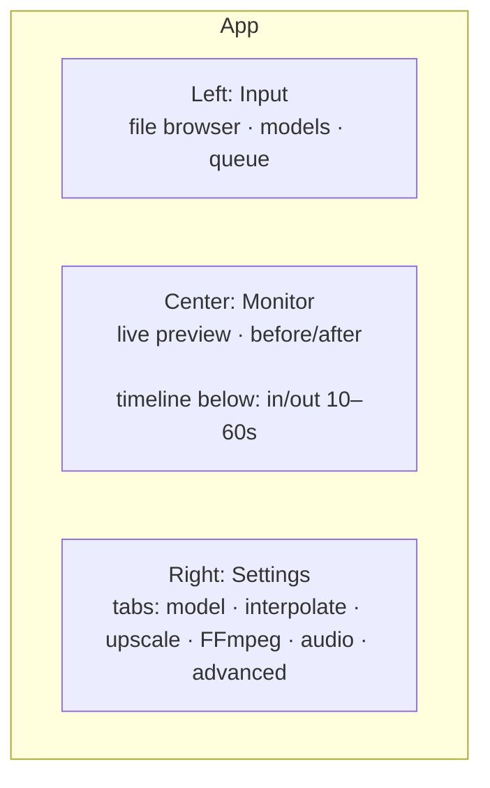
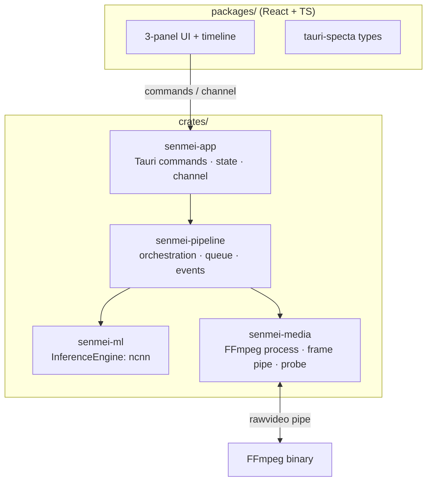

# Senmei — Implementation Plan

> Rust re-implementation of a video enhancer modeled after REAL Video Enhancer (RVE).
> **Senmei (鮮明)** — GitHub: [senmei-app](https://github.com/senmei-app)
> GUI concept inspired by [Koharu](https://github.com/mayocream/koharu) and VS Code.

---

## 0. Vision

A fast, modern desktop video enhancer in Rust with:

- **Frame interpolation** (e.g. 24 → 48 fps) and **upscaling** (e.g. 1080p → 4K)
- **GPU inference**: NCNN/Vulkan via C++ shim with CPU fallback — no libtorch, no ONNX, no TorchScript
- **Consistent HTML/CSS/JS UI** via platform webviews (webkit2gtk / WebView2 / WKWebView)
- **Better FFmpeg settings** than RVE (profile-based, extensible, validated)
- **Sample preview** of 10–60 s directly in the app

---

## 1. Agreed Decisions

| # | Topic | Decision |
|---|---|---|
| 1 | Shell / UI host | **Tauri 2 + platform webview** (webkit2gtk / WebView2 / WKWebView), not CEF |
| 2 | Frontend | **React + TypeScript**, `react-resizable-panels`, Tailwind, lucide-react |
| 3 | Inference | **NCNN/Vulkan** via C++ shim (`cxx`/bindgen), CPU fallback — no libtorch, no ONNX, no candle |
| 4 | No ONNX / no TorchScript | all models run via NCNN (`.param`/`.bin`); no safetensors graph loading |
| 5 | No WebGPU/WASM | preview via FFmpeg-decoded frames → 2D canvas (codec-agnostic, incl. H.265) |
| 6 | Media | **FFmpeg as subprocess** with `rawvideo` pipe; prefer **system FFmpeg**, fallback: portable download (BtbN builds) into data dir |
| 7 | Layout | **3-panel + timeline**: Input \| Monitor \| Settings |
| 8 | Codecs | in-app preview is **codec-agnostic** (FFmpeg decode → canvas, incl. H.265); final file freely selectable (x264/x265) |
| 9 | Phase-1 models | **RIFE** (interpolation) + **SPAN / Real-ESRGAN** (upscale) |
| 10 | Platform order | **Linux first** (AMD/ROCm), then Windows, then macOS |
| 11 | License | **MIT OR Apache-2.0** (Koharu-style), FFmpeg as **LGPL build**, no AGPL code |
| 12 | Name | **Senmei (鮮明)** · GitHub org `senmei-app` · binary `senmei` |

---

## 2. Technology Stack

| Layer | Choice | Rationale |
|---|---|---|
| Shell | Tauri 2 + platform webview | IPC/plugins/windows for free, small footprint |
| Frontend | React 18+ / TypeScript / Vite | simple, Koharu-compatible pattern |
| Package manager | **bun** | like Koharu (fast, bun lockfile) |
| UI kit | Base UI + Tailwind CSS + lucide-react | Koharu pattern, maintainable |
| IPC | Tauri commands + `tauri-specta` + `Channel` | typed bridge, streaming for preview |
| Inference | NCNN via C++ shim (`cxx`/bindgen) | Vulkan + CPU fallback |
| Media | FFmpeg subprocess (`rawvideo` pipe) | robust, full encoder selection |
| Async | tokio | worker threads for inference |
| Config | serde + JSON (`config.json` + profiles) | persistable, schema-validated |

---

## 3. GUI Concept

### 3.1 Layout (3-Panel + Timeline)



| Panel | Width (default) | Content |
|---|---|---|
| **Left** | ~18 % | file browser, model library, render queue (batch) |
| **Center** | ~58 % | live monitor, before/after split, below it **timeline** |
| **Right** | ~24 % | **tabbed** settings (no endless scroll like RVE) |

- All panels **collapsible/resizable** (`react-resizable-panels`)
- **Timeline** with in/out markers, preset buttons `10s / 15s / 30s / 60s / custom`
- Settings tabs (Koharu pattern): `Model`, `Interpolate`, `Upscale`, `FFmpeg`, `Audio/Subtitles`, `Advanced`

### 3.2 Preview (no WebGPU/WASM)

| Task | Solution |
|---|---|
| Live monitor (last frame) | Rust → JPEG → Tauri `Channel<PreviewFrame>` → `createImageBitmap` → 2D `<canvas>` (~10–15 fps) |
| Before/after | two bitmaps, movable divider (CSS `clip-path`) |
| Sample playback | FFmpeg decodes frames (any codec incl. H.265) → 2D canvas; audio via `<audio>` (AAC/Opus) |

---

## 4. Architecture



A **single process** — no Python-subprocess separation like in RVE.

---

## 5. Workspace Structure

```
senmei/
├─ Cargo.toml                 # workspace
├─ package.json               # frontend root (bun)
├─ .gitignore
├─ README.md
├─ crates/
│  ├─ senmei/                 # entry point, logging, diagnostics, version
│  ├─ senmei-app/             # Tauri commands, app state, IPC (Channel<PreviewFrame>)
│  ├─ senmei-pipeline/        # render orchestration, queue, events, progress
│  ├─ senmei-ml/              # InferenceEngine trait, ncnn engine, model registry
│  └─ senmei-media/           # FFmpeg process, frame decode/encode, video probe, encoder profiles
├─ packages/
│  ├─ ui/                     # reusable UI kit (Base UI + Tailwind)
│  ├─ bridge/                 # generated types (tauri-specta)
│  └─ app/                    # React frontend (3-panel + timeline)
└─ models/                    # .param / .bin + metadata.json
```

---

## 6. Inference Design (`senmei-ml`)

### 6.1 Engine Trait

```rust
pub trait InferenceEngine: Send + Sync {
    fn name(&self) -> &'static str;
    fn capabilities(&self) -> EngineCaps;            // backend, half-precision, tiles
    fn load(&mut self, model: &ModelRef) -> Result<()>;
    fn infer(&mut self, input: &Tensor, opts: &InferOptions) -> Result<Tensor>;
}
```

### 6.2 Engines

| Engine | Backend | Model format |
|---|---|---|
| `NcnnEngine` | Vulkan + CPU fallback (C++ shim via `cxx`/bindgen) | ncnn `.param` + `.bin` (community ports) |

- **No ONNX Runtime, no libtorch, no TorchScript, no candle.** Models are **downloaded** as ncnn `.param`/`.bin` (Koharu-style: pinned repo + commit SHA) — **no conversion, no Python, no Rust arch ports**.
- The per-model cost is finding/verifying a **permissively-licensed community NCNN port**; the Rust side just shells out via the shim.
- NCNN/Vulkan is the GPU path, NCNN's CPU path is the fallback — one backend covers all. Decision is benchmark-verified (2026-08-16) — see `docs/benchmarks.md`.

### 6.3 Backend Matrix (honest)

| Platform / GPU | NCNN/Vulkan | CPU fallback |
|---|---|---|
| NVIDIA (Win/Linux) | ✅ | ✅ |
| AMD Linux | ✅ (Mesa/RADV) | ✅ |
| AMD Windows | ✅ | ✅ |
| Intel Arc Linux | ✅ | ✅ |
| Intel Windows | ✅ | ✅ |
| Apple Silicon | ⚠️ via MoltenVK | ✅ |
| CPU-only | ❌ | ✅ |

### 6.4 Model Registry

```json
{
  "id": "rife-4.26",
  "kind": "interpolate",            // interpolate | upscale | denoise | decompress | deblur
  "scale": 1,
  "arch": "rife425",
  "ncnn": ["rife-4.26.param", "rife-4.26.bin"],
  "metadata": { "input_range": "0..1", "half": true }
}
```

---

## 7. Media Design (`senmei-media`)

### 7.1 FFmpeg as Subprocess

- **Decode**: `ffmpeg -ss <in> -i input -f rawvideo -pix_fmt rgb24 -` → frames via stdout
- **Encode**: processed frames via stdin → `ffmpeg -f rawvideo -pix_fmt rgb24 -s WxH -r FPS -i - <encoder> output`
- Color conversion (YUV→RGB) is done by **`swscale`** directly during decode

### 7.2 "Better FFmpeg settings" (profile-based instead of hard-coded)

Instead of RVE's `if/else` encoder blocks, a **schema-driven profile system**:

```json
{
  "encoders": {
    "libx265": {
      "quality_model": "crf",
      "pixel_formats": ["yuv420p", "yuv420p10le", "yuv444p"],
      "presets": ["placebo", "slow", "medium", "fast", "veryfast"],
      "advanced": ["bf", "refs", "aq-mode", "psy-rd", "tune", "two_pass"]
    }
  },
  "profiles": {
    "output": { "encoder": "libx265", "quality": "high", "pixel_format": "yuv420p10le" }
  }
}
```

Features:
1. Profile presets (Lossless/Ultra/Very High/High/Medium/Low) per encoder
2. Advanced parameters (B-frames, refs, AQ, psy-rd, tune, 10-bit)
3. Two-pass (for target bitrate)
4. Free filter-chain field (e.g. `zscale`, `tonemap`) with live validation
5. HDR→SDR tone mapping + color metadata (colorprim/transfer/matrix)
6. Audio: AAC/Opus/FLAC/passthrough · subtitles: copy/srt/ass/webvtt
7. HW encoders with capability detection (NVENC/VAAPI/AMF/VideoToolbox)
8. **Output profile** (final file); in-app preview is frame-based (no encode needed)
9. Live command preview + validation

---

## 8. Pipeline / Data Flow


---

## 9. Sample/Preview (10–60 s)

- Timeline with **in/out markers** + preset buttons
- Exact seek via FFmpeg (`-ss` after `-i`)
- Sample playback is **codec-agnostic** (incl. H.265): FFmpeg decodes sample → frames → 2D canvas; audio via `<audio>` (AAC/Opus)
- Button **"apply sample settings to full render"**
- Live monitor: last frame as JPEG via `Channel`, ~10–15 fps

---

## 10. Milestones

| # | Milestone | Content | Status |
|---|---|---|---|
| **M0** | **Scaffold** | workspace, cargo crates (empty/stub), Tauri shell, React 3-panel, `InferenceEngine` trait | ✅ done |
| **M1** | **FFmpeg passthrough** | decode → frames → encode end-to-end (no ML), first renderable chain | ✅ done |
| **M2** | **Upscaling** | SPAN/Real-ESRGAN via NCNN, tiling, progress | 🟡 reference bilinear scaler only (ML via NCNN pending M6) |
| **M3** | **Interpolation** | RIFE via NCNN, scene-change detection, interpolation factor | 🟡 linear blend + scene-cut only (RIFE pending) |
| **M4** | **Settings** | FFmpeg profile system, command preview, audio/subtitles/HDR | 🟡 basic settings only |
| **M5** | **Sample/Preview** | timeline in/out, 10–60 s sample, before/after, live monitor | ⬜ pending |
| **M6** | **NCNN/Vulkan** | C++ shim + `NcnnEngine` (primary engine, decided 2026-08-16), backend selection | ⬜ pending (`NcnnEngine` is a stub) |
| **M7** | **Advanced** | GMFSS/GIMM/IFRNet, model downloader, batch queue | ⬜ pending |
| **M8** | **Packaging** | model bundling/download, static FFmpeg, installer, auto-updater | ⬜ pending |

---

## 11. Risks

1. **NCNN model availability** (largest effort): find a community NCNN port (`.param`/`.bin`) per model, or convert once maintainer-side (`pnnx`/`onnx2ncnn`) where licenses allow. Weights are **not bundled** — the app downloads them from a pinned upstream URL on first use (download-on-demand), so redistribution licensing is not required for the weights.
   - RIFE/SPAN/Real-ESRGAN/Real-CUGAN: ports available
   - GMFSS/GIMM (custom CUDA kernels like Softsplat): schedule **late**
2. ~~libtorch size~~ — resolved: no libtorch; NCNN is a small native dep, models are `.param`/`.bin` downloads.
3. **Preview codec**: HEVC is **not** supported in webviews — in-app preview is frame-based (FFmpeg decode → canvas), so any source codec (incl. H.265) plays.
4. **Single-backend risk**: NCNN covers all vendors; the CPU fallback keeps dev/render usable without Vulkan.

---

## 12. Decided Points (after review)

| Point | Decision |
|---|---|
| Frontend build | **Vite** |
| Package manager | **bun** (like Koharu) |
| inference runtime | **NCNN/Vulkan** (C++ shim) — no libtorch / no ONNX / no candle |

Still open: **green light for M0** (name is decided: Senmei / `senmei-app`).

---

## 13. Next Step after Review

As soon as you give the green light, I create **M0**:

1. Cargo workspace with the 5 crates (stub code)
2. `InferenceEngine` trait + empty `NcnnEngine` stub
3. Tauri shell (`senmei-app`) with health-check command
4. React frontend with 3-panel layout + timeline placeholder
5. `senmei-media` stub (FFmpeg probe)
6. `models/` with example `metadata.json`

---

## 14. License

**Own code: MIT OR Apache-2.0** (dual license like Koharu). **No AGPL code is adopted** — everything is cleanly re-implemented.

| Component | License | Note |
|---|---|---|
| Own code | **MIT OR Apache-2.0** | user chooses one of the two |
| FFmpeg | **LGPL build** (dynamically linked) | compatible with permissive license; **do not bundle a GPL build** |
| NCNN | BSD-3-Clause | permissive, compatible |
| Tauri / React | MIT / Apache / BSD | permissive, compatible |

**Models (separately published, permissive — NOT from RVE code):** RVE itself is AGPL-3.0, but the models it runs are published independently under permissive licenses. We only adopt the **weights + architecture definitions**, never RVE code. Each model's license + source is recorded in `models/metadata.json`.

| Model | Kind | License | Source |
|---|---|---|---|
| RIFE 4.26 | interpolate | **MIT** | `hzwer/Practical-RIFE` |
| Real-ESRGAN x4plus / x4plus-anime / x2plus | upscale | **BSD-3-Clause** | `xinntao/Real-ESRGAN` |
| Real-CUGAN up2x | upscale | **MIT** | `nihui/realcugan-ncnn-vulkan` (bilibili/ailab) |
| SwinIR x2 (classical) / x4 (real-world) | upscale | **Apache-2.0** | `JingyunLiang/SwinIR` |
| HAT-S x4 | upscale | **Apache-2.0** | `XPixelGroup/HAT` |

**SPAN** (`hongyuanyu/SPAN`) is **Apache-2.0** (ships `LICENSE.txt`) — the earlier “no license / excluded” note is outdated; it is now a top upscaler candidate. See [`docs/models.md`](models.md) for the full adoption matrix. Modern anime upscalers (ShuffleCugan, OpenProteus, …) can be added when an NCNN port with a permissive weight license exists; TAS itself is AGPL, so its vendored code stays off-limits. Candidate/undecided models are tracked in `docs/models.md`.

Weights are **never committed** — only downloaded; `metadata.json` holds id/kind/arch/scale + license/source_url.

**Note (codecs):** `libx264`/`libx265` require a **GPL** FFmpeg build — conflicts with the LGPL-only rule. Dev encoder uses `libx264`; when bundling (M8) pick a GPL build for output, or LGPL-safe encoders (`libopenh264` / HW `h264_nvenc`/`vaapi`). In-app preview is frame-based (canvas) and needs no encoder.

**Optional:** if a weak copyleft for the own code is desired later, **LGPL-3.0** is possible as an alternative — the default is **MIT OR Apache-2.0**.

**Important:** RVE and TAS are **AGPL-3.0**. If their code parts (FFmpeg logic, conversion scripts, NCNN wrapper) are adopted, the project automatically becomes AGPL-3.0 — therefore always cleanly re-implement.

---

## 15. Current Status (Implementation Log)

> Kept in sync with actual implementation. Update on every significant change.

- **Inference engine switch v2 (decision, 2026-08-16)** — after benchmarking on the target AMD RX 9070 (RDNA4/`gfx1201`), the engine is **NCNN/Vulkan** via C++ shim (`cxx`/bindgen) with **CPU fallback**. **candle is dropped** (no ROCm backend; per-model Rust ports). **burn set aside** (fusion/JIT immature for SR). Model format is ncnn `.param`/`.bin` (community ports) — **no safetensors graph loading, no conversion, no Python, no Rust arch ports**. The per-model cost is finding a permissively-licensed NCNN port. Evidence in `docs/benchmarks.md`: ncnn 1080p x2 = 398 ms vs torch-ROCm 7153 ms (pathological) + tile OOM/hard-fault on RDNA4. Obsolete vs v1: `CandleEngine`, `.safetensors` loading, "port each arch to Rust" plan. Registry schema: `torch` field → `ncnn` (see §6.4).
- **NCNN-only code switch (2026-08-16)** — removed the `torch` feature, `tch` dep, `TorchEngine`, and the `torch`/`download_url`/`sha256` `ModelMetadata` fields. `engine_for_model` maps only `.param`/`.bin` → `NcnnEngine`; `Registry::resolve` points at the `.param` (the `.bin` sits alongside). Registry = 7 NCNN models (`rife-4.26`, Real-ESRGAN ×3, Real-CUGAN up2x, SwinIR x2/x4) — `loadable: false` until the C++ shim lands (M6). Dropped the `download_model` command + `senmei_media::download_model`, the `scripts/convert_*.py` pipeline, and local `models/*.pt`. `Backend` = `Cpu | Vulkan`. Bridge bindings regenerated. Exact NCNN asset filenames still need pinning in M7.
- **Download-on-demand (decision, 2026-08-16)** — model weights are **not bundled or redistributed**. The app downloads `.param`/`.bin` from a pinned upstream URL on first use (M7). Keeps the runtime small and sidesteps redistribution-license questions for models whose ports lack a clear license; `metadata.json` records license + source for transparency.
- **Libtorch downloader/UI cleanup (TODO, 2026-08-16)** — the libtorch provisioning path still exists (`senmei-media/src/libtorch.rs`, `get_libtorch_status`/`download_libtorch`, `useLibtorch`, SettingsPage inference section, i18n strings) and contradicts the engine switch. Remove it in a follow-up; the Settings inference section should later show the NCNN backend instead.
- ~~**Inference engine switch (decision, 2026-08-16)**~~ — **superseded by v2** (candle dropped after benchmarks; engine = NCNN/Vulkan) — libtorch/`tch`/TorchScript is **dropped**. `senmei-ml` moves to **candle** (CPU/CUDA/Metal) + **NCNN/Vulkan** (no ONNX, no TorchScript). Models are **downloaded** as `.safetensors` from pinned HF repos (Koharu-style `model_repository!` pattern, repo + commit SHA) — **no conversion, no Python**. Each architecture is **ported to Rust** (`candle-nn`) once; that is the main per-model cost. Consequence: the ROCm/AMD-Linux accelerated path is dropped (AMD → NCNN/Vulkan). Obsolete: the `torch` feature, `tch` dep, `TorchEngine`, `scripts/convert_*.py`, and the existing `.pt` files (models re-fetched as `.safetensors`).
- **M0 done** — workspace, 5 crates, `InferenceEngine` trait + engine stubs + model registry, Tauri shell (frameless), React UI, `models/metadata.json`, LICENSE (MIT/Apache), crates.io names secured.
- **M1 done** — FFmpeg passthrough: `senmei-media` decoder/encoder (`rawvideo` pipe), `senmei-pipeline` (`Step`, `Passthrough`, `Pipeline::run`), `render` command + progress channel.
- **UI deviations from §3.1** — Settings panel uses **2 top-level tabs** (`Settings` / `Advanced`) with **accordions** inside, instead of the 6 tabs from the plan. Steps: Interpolate, Decompress, Denoise, Deblur, Upscale, Deduplication, Resize, Output Resize (Settings) + Video Encoder, Audio Encoder, Backend (Advanced).
- **Project flow** — start screen with new/open project; projects stored as directories under `~/.local/share/senmei/projects/` (+ JSON index for browsed folders).
- **Settings page** — dedicated page (not modal) with section sidebar; **Appearance** section holds Language (EN/DE) + Theme (light/dark/system), persisted in `~/.local/share/senmei/settings.json`. Extensible for more settings.
- **i18n** — English default + German; switch in the top bar and Settings.
- **Window controls** — minimize/maximize/close on both the project start screen and the main window (frameless).
- **Theme** — light/dark applied across all components via Tailwind `dark:` classes; `system` follows `prefers-color-scheme`.
- **UI fix** — top bar has `z-50` so menu dropdowns render above the live monitor (stacking-context issue with `backdrop-blur`).
- **Window controls fix** — Tauri v2 ACL: `minimize`/`toggleMaximize`/`close` need explicit `core:window:allow-*` permissions in `capabilities/default.json` (not part of `core:default`). **Window dragging** needs `core:window:allow-start-dragging` (also not in `core:default`) — added.
- ~~**libtorch provisioning (decision)**~~ — **superseded 2026-08-16** (libtorch dropped; see engine switch) — libtorch is **not** bundled; downloaded at first run via Settings → Inference: backend auto-detected (CUDA via `nvidia-smi`, else ROCm via `/dev/kfd`, else CPU) and the matching pytorch.org archive is fetched into `~/.local/share/senmei/libtorch/`. **Version:** `tch 0.24` / `torch-sys 0.24` expect **libtorch 2.11.0** (URLs pinned to 2.11.0: CPU / cu126 / **rocm7.1**; newer archives use the `libtorch-shared-with-deps` filename — no `cxx11-abi`). **Note:** `tch` links libtorch at **build time**, so after the download build with `LIBTORCH=~/.local/share/senmei/libtorch cargo build --features senmei-ml/torch`. Runtime dynamic-load is not supported by `tch`.
- ~~**ROCm not a system dependency (decision)**~~ — **superseded 2026-08-16** (ROCm path dropped with libtorch) — the libtorch ROCm archive **bundles its own ROCm runtime libs** (`libamdhip64.so`, `libMIOpen.so`, `librocblas.so`, … resolve inside `libtorch/lib/`, verified via `ldd`). End users therefore need **no system ROCm install**; only a Linux kernel with `amdgpu` + KFD (`/dev/kfd`) and an AMD GPU. Backend detection uses `/dev/kfd`, not an installed ROCm version. At M8 (packaging) ship the bundled libtorch and document „AMD GPU + `/dev/kfd`" as the requirement.
- **FFmpeg sourcing (decision)** — prefer **system FFmpeg** (Linux: x264/x265/NVENC/VAAPI present). If missing/too old: download **portable FFmpeg** (BtbN GPL builds) into `~/.local/share/senmei/bin/` with progress UI (RVE-style). `get_ffmpeg_status` + `download_ffmpeg` commands; no bundling in installer (GPL binary is a separate process, does not affect MIT/Apache code). macOS download TBD at M8. Resolution order (used by status AND the decode/encode pipeline): valid `SENMEI_FFMPEG` env → system `ffmpeg` → portable. `SENMEI_FORCE_FFMPEG_MISSING=1` simulates a missing FFmpeg for testing the download flow.
- **Webview decision (revision)** — CEF dropped; use Tauri platform webview. In-app preview is **frame-based** (FFmpeg decode → canvas) so it is codec-agnostic (incl. H.265); audio via `<audio>` (AAC/Opus). Final output via FFmpeg (x264/x265).
- **tauri-specta** — typed bindings replace the hand-written bridge: `collect_commands!` + `#[specta::specta]`, `bindings.ts` generated (camelCase, Throw errors), bridge re-exports. `export_ts_bindings` test regenerates.
- **Logging** — `log`/`env_logger` initialized in `senmei`; logs in commands/media/pipeline (render, download, ffmpeg install).
- **Tests** — registry (`from_json`, `load_dir`), encoder capability parsing, settings roundtrip/defaults, project dir creation, passthrough, ffmpeg probe (9 tests).
- **Download integrity** — SHA-256 of the portable FFmpeg archive is verified against a pinned constant (`FFMPEG_SHA256`); BtbN provides no stable tag/checksum, so update the constant on bump.
- **De-mocked UI** — render button wired (output dialog + progress in status bar); TopBar/StatusBar/Monitor driven by real state (files, health, FFmpeg version); Inspector model selects populated from the real model registry via `list_models`.
- **UI kit** — `packages/ui` provides theme-aware `Button` (primary/secondary/ghost) and `Chip`; used in ProjectScreen/SettingsPage; added to Tailwind content.
- **M2 (partial, upscaling)** — `senmei-ml`: **tiling** (tile/stitch, overlap, tested) + **reference bilinear scaler** (tested). `senmei-pipeline`: **`Upscale` step** (Frame↔Tensor, engine or reference fallback, tested). `render` accepts `scale`; UI has 2x/3x/4x control (Inspector) and progress; **upscaling works end-to-end** via the reference scaler without ML. **`TorchEngine`** (real `tch`/libtorch) is implemented behind the `torch` feature — **requires a full libtorch install (headers) + a TorchScript model**; not compiled/verified here (local libtorch is runtime-only). Enable with `--features senmei-ml/torch` + `LIBTORCH=<full-libtorch>`.
- **M2 (tiled inference)** — **`infer_tiled`** in `senmei-ml` wraps an engine so large inputs are split into overlapping tiles, inferred per tile, and stitched (overlap-averaged, canvas scaled by the engine's per-tile scale). Used by `Upscale` with a default `tile_size` of 256 when the engine advertises `tiles`. **Tests** (4): identity reconstruction, scaled output dims, skip-tiling on small input, whole-image path for engines without tiling.
- **M2 (engine selection)** — **`engine_for_model`** picks an engine by weight-file format (`.pt` → `TorchEngine`, `.param`/`.bin` → `NcnnEngine`, else error). **`Registry::resolve(id, dir)`** maps a model id to a `ModelRef` pointing at its torch weight file. The `render` command now takes an optional `model_id`: the Inspector's Upscale model select passes it through, so a real engine is loaded and handed to the `Upscale` step (reference scaler remains the fallback when no model is selected). **Tests** (2): factory-by-format, registry-resolves-model-ref.
- **M2 (model download)** — **`senmei_media::download_model`** (reusing the shared `downloader`) fetches a model weight file into `models/`, verifies SHA-256 against `metadata.json`'s `sha256` (temp-file-then-rename, so a mismatch never leaves a corrupt weight). `ModelMetadata` gains `download_url` + `sha256` fields. New `download_model` command + Inspector "Download weights" button per downloadable model (`useModel` hook). Real-ESRGAN `realesrgan-x4plus` has a pinned URL + checksum. **Note:** the official Real-ESRGAN release is a `.pth` state dict — a one-time conversion to TorchScript `.pt` (per PLAN §6) is still required before `TorchEngine` can load it. **Tests** (1): checksum match/mismatch.
- **M2 (resize + encoder dims)** — new **`Resize` step** (planar-RGB bilinear by a **scale factor**, tested: grow/shrink/noop/color). `Pipeline::run` now opens the encoder with the **first processed frame's dims** instead of the decoder's, so any size-changing step (upscale/resize) produces a correctly-sized output. `render` takes optional `resize` + `output_resize` (`f32` factor, applied before/after upscale); Inspector Resize/Output Resize accordions get a single factor input (empty = off), replacing the "— M2" placeholders. If a selected model can't be loaded (missing weights/unsupported format), render logs a warning and falls back to the **reference scaler** instead of aborting. **Tests** (2 e2e): 160x120 → upscale x2 → 320x240; 160x120 → resize 0.5 → 80x60.
- **M2 (review fixes)** — **Frame↔Tensor layout fix**: FFmpeg frames are packed `rgb24`, but `frame_to_tensor`/`tensor_to_frame` did a linear copy into planar NCHW, scrambling every upscaled/resized frame's pixels (dims-only tests hid it). Now de-interleaved/interleaved correctly. **Scale enforcement**: an engine's fixed upscale factor (e.g. x4) is now resized back to the requested scale, so the UI scale choice is authoritative. **`loadable` flag** on `ModelMetadata`: `realesrgan-x4plus` is marked `loadable: false` (`.pth` state dict awaiting TorchScript conversion), so render no longer auto-downloads unusable weights. Non-torch `TorchEngine` stub now reports `Cpu` (was `Cuda`), and `Decoder.total_frames` guards against 0 (progress NaN). **Tests** added: frame↔tensor pixel roundtrip, upscale x1 pixel preservation, engine-scale enforcement.
- **Project settings persistence** — the Inspector's per-step enabled toggles are persisted in **`<project>/project.json`** (`steps_enabled` map), loaded when a project opens and saved on every change (`load_project_settings` / `save_project_settings` commands, tested roundtrip). The Accordion `enabled` state is now controlled from App. Expanding an accordion enables the step; **collapsing leaves it unchanged** (fix: previously every row click also enabled the step).
- **Dev workflow (decision)** — `bun run dev` runs **`cargo tauri dev`** (Koharu-style): Tauri CLI starts Vite (`beforeDevCommand`) and `cargo run`s the app with hot-reload. `tauri.conf.json` (+ `capabilities/`, `icons/`, `build.rs`) live in the **bin crate `crates/senmei`**, not `senmei-app`, because `tauri::generate_context!`/`tauri_build` read the config relative to the crate's manifest dir; `senmei-app` stays a pure lib (`specta_builder` + commands). Root `package.json`: `dev` → `cargo tauri dev`, `ui:dev` → frontend only. **Note:** `beforeDevCommand` runs from the **repo root** (verified), so paths are `packages/app`, not `../`. `default-run = "senmei"` makes `cargo tauri dev` pick the right bin.
- **Dependency security** — **JS:** bumped `vite` `5.4.x → 7.3.x` to clear 4 Dependabot alerts (vite `fs.deny` bypass + `.map` path traversal + launch-editor NTLMv2, and esbuild dev-server — esbuild is only patched ≥0.25, hence Vite 7). `bun audit` reports no vulnerabilities. **Rust:** one open Dependabot alert on `glib 0.18.5` (`VariantStrIter` unsoundness, fixed only in ≥0.20) is an **upstream blocker** — `gtk 0.18.2` (last GTK3 binding) pins `glib ^0.18`, and `tauri 2.11.5` is the latest; no patched 0.18.x exists, so it is unresolvable by `cargo update` until the Tauri/gtk-rs stack moves to glib 0.20. **Accepted risk** (dismissed on GitHub as "Risk is tolerable to this project"): the vulnerable `VariantStrIter` API is never exercised by the app.
- **M3 (interpolation, partial)** — `senmei_ml::interpolate` provides `mean_abs_diff`/`is_scene_cut`/`blend`; a stateful pipeline **`Interpolator`** emits `factor-1` blended intermediates between consecutive frames, or **duplicates across scene cuts** (threshold 0.25 mean-abs-diff). `Pipeline::run` accepts an optional interpolator and scales the encoder **fps** and progress total by the factor; frame↔tensor conversion moved to a shared `frame` module. `render` takes `fps_multiplier`; the Inspector fps buttons (2x/3x/4x, toggleable) drive it, and the interpolate model select no longer writes to the upscale model. **RIFE TorchScript inference is still pending** — the reference path is linear blending (rife-4.26 has no downloadable `.pt` yet). **Tests**: ml blend/scene-cut (4), interpolator factor/scene-cut (4), e2e fps doubling (1).
- **Real-ESRGAN TorchScript conversion** — `scripts/convert_realesrgan.py` converts official Real-ESRGAN RRDBNet checkpoints into loadable TorchScript; it auto-detects `num_block` and the input layout (classic 3-channel, or `pixel_unshuffle` for the x2 model) and traces two 2× nearest upsamples. Registry has three loadable upscalers: `realesrgan-x4plus` (4×), `realesrgan-x4plus-anime` (6B, 4×), `realesrgan-x2plus` (2×). Verified via the ignored `torch_loads_realesrgan_models` test (loads in `TorchEngine`, 64→64·scale). The `.pt`s are **not committed** (`models/*.pt` ignored) and `download_url`/`sha256` are dropped (they pointed at unloadable `.pth`s). Requires `torch` + `libtorch` to build/run with the `torch` feature.
- ~~**Model ingest (decision)**~~ — **superseded 2026-08-16** (models are now downloaded as ncnn `.param`/`.bin`, not converted to TorchScript) — raw `.pth` state dicts are converted **once** to TorchScript, maintainer-side (`scripts/convert_realesrgan.py`, needs Python + torch). End users never convert: the finished `.pt`s are **bundled/downloaded at M8** (like libtorch provisioning). `spandrel` (MIT) can later broaden the converter to more architectures; each adopted model must itself carry a permissive license (BSD/MIT/Apache).
- ~~**More upscalers (spandrel)**~~ — **superseded 2026-08-16** (conversion pipeline dropped; models downloaded as ncnn `.param`/`.bin`) — `scripts/convert_spandrel.py` converts permissively-licensed checkpoints (`.pth`/`.safetensors`) to TorchScript via spandrel (MIT): it retargets window-attention models (SwinIR/HAT) to the runtime tile size (256), re-derives their attention masks, and verifies trace==eager. Registered 4 new loadable upscalers: `real-cugan-x2` (MIT, anime 2×), `swinir-x2` (Apache-2.0, classical 2×), `swinir-x4` (Apache-2.0, real-world 4×), `hat-x4` (Apache-2.0, real-world 4×). **Tiling fix:** traced window-attention transformers are resolution-locked, so `infer_tiled` now pads small inputs to a full tile and `tile()` edge-aligns the last tile — every tile is exactly `tile_size`; padded borders are cropped from the output. `.pt`s are not committed; verified via the ignored `torch_loads_upscaler_models` test.
