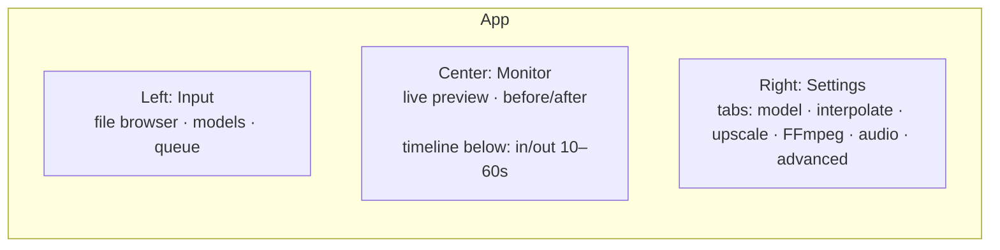
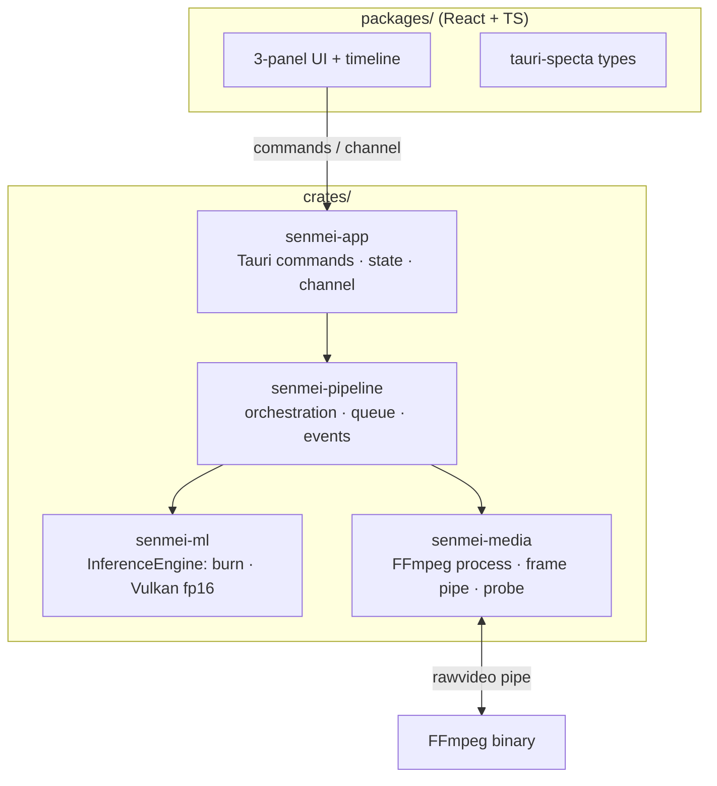
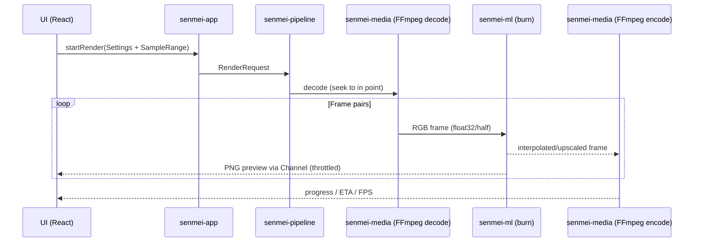

# Senmei — Implementation Plan

> Rust re-implementation of a video enhancer modeled after REAL Video Enhancer (RVE).
> **Senmei (鮮明)** — GitHub: [senmei-app](https://github.com/senmei-app)
> GUI concept inspired by [Koharu](https://github.com/mayocream/koharu) and VS Code.

---

## 0. Vision

A fast, modern desktop video enhancer in Rust with:

- **Frame interpolation** (e.g. 24 → 48 fps) and **upscaling** (e.g. 1080p → 4K)
- **GPU inference**: **burn (`burn-wgpu`) on the Vulkan backend, fp16** with CPU fallback — no libtorch, no ONNX Runtime, no TorchScript, no candle, no ncnn
- **Consistent HTML/CSS/JS UI** via platform webviews (webkit2gtk / WebView2 / WKWebView)
- **Better FFmpeg settings** than RVE (profile-based, extensible, validated)
- **Sample preview** of 10–60 s directly in the app

---

## 1. Agreed Decisions

| # | Topic | Decision |
|---|---|---|
| 1 | Shell / UI host | **Tauri 2 + platform webview** (webkit2gtk / WebView2 / WKWebView), not CEF |
| 2 | Frontend | **React + TypeScript**, `react-resizable-panels`, Tailwind, lucide-react |
| 3 | Inference | **burn (`burn-wgpu`) on the Vulkan backend, fp16**, CPU fallback — no libtorch, no ONNX Runtime, no candle, no ncnn engine |
| 4 | No ONNX Runtime / no TorchScript | every arch is a **clean burn re-implementation**; weights from a permissive source (torch `.pth` → f16 `.bpk`, ONNX `.onnx` via a built-in reader, or ncnn `.bin` for RIFE) |
| 5 | No WebGPU/WASM | preview via native `<video>` where the webview can play the file; FFmpeg-decoded frame fallback (codec-agnostic, incl. H.265) |
| 6 | Media | **FFmpeg as subprocess** with `rawvideo` pipe; prefer **system FFmpeg**, fallback: portable download (BtbN builds) into data dir |
| 7 | Layout | **3-panel + timeline**: Input \| Monitor \| Settings |
| 8 | Codecs | in-app preview is **codec-agnostic** (FFmpeg decode → canvas, incl. H.265); final file freely selectable (x264/x265) |
| 9 | Phase-1 models | **RIFE** (interpolation) + **SPAN / Real-ESRGAN** (upscale) |
| 10 | Platform order | **Linux first** (AMD/ROCm), then Windows, then macOS |
| 11 | License | **MIT OR Apache-2.0** (Koharu-style), FFmpeg as **LGPL build**, no AGPL code |
| 12 | Name | **Senmei (鮮明)** · GitHub org `senmei-app` · binary `senmei` |

---

## 2. Technology Stack

| Layer | Choice | Rationale |
|---|---|---|
| Shell | Tauri 2 + platform webview | IPC/plugins/windows for free, small footprint |
| Frontend | React 18+ / TypeScript / Vite | simple, Koharu-compatible pattern |
| Package manager | **bun** | like Koharu (fast, bun lockfile) |
| UI kit | Base UI + Tailwind CSS + lucide-react | Koharu pattern, maintainable |
| IPC | Tauri commands + `tauri-specta` + `Channel` | typed bridge, streaming for preview |
| Inference | burn (`burn-wgpu`, Vulkan fp16) | one backend, GPU + CPU fallback; clean Rust ports |
| Media | FFmpeg subprocess (`rawvideo` pipe) | robust, full encoder selection |
| Async | tokio | worker threads for inference |
| Config | serde + JSON (`config.json` + profiles) | persistable, schema-validated |

---

## 3. GUI Concept

### 3.1 Layout (3-Panel + Timeline)



| Panel | Width (default) | Content |
|---|---|---|
| **Left** | ~18 % | file browser, model library, render queue (batch) |
| **Center** | ~58 % | live monitor, before/after split, below it **timeline** |
| **Right** | ~24 % | **tabbed** settings (no endless scroll like RVE) |

- All panels **collapsible/resizable** (`react-resizable-panels`)
- **Timeline** with in/out markers, preset buttons `10s / 15s / 30s / 60s / custom`
- Settings tabs (Koharu pattern): `Model`, `Interpolate`, `Upscale`, `FFmpeg`, `Audio/Subtitles`, `Advanced`

### 3.2 Preview (no WebGPU/WASM)

| Task | Solution |
|---|---|
| Live monitor (last frame) | Rust → PNG → Tauri `Channel<PreviewFrame>` → 2D `<canvas>` |
| Before/after | two bitmaps, movable divider (CSS `clip-path`) |
| Sample playback | native `<video>` (hardware decode) where supported; else FFmpeg decodes frames → 2D canvas; audio via `<audio>` (AAC/Opus) |

---

## 4. Architecture



A **single process** — no Python-subprocess separation like in RVE.

---

## 5. Workspace Structure

```
senmei/
├─ Cargo.toml                 # workspace
├─ package.json               # frontend root (bun)
├─ .gitignore
├─ README.md
├─ crates/
│  ├─ senmei/                 # entry point, logging, diagnostics, version
│  ├─ senmei-app/             # Tauri commands, app state, IPC (Channel<PreviewFrame>)
│  ├─ senmei-pipeline/        # render orchestration, queue, events, progress
│  ├─ senmei-ml/              # InferenceEngine trait, burn engine (Vulkan fp16), model registry
│  └─ senmei-media/           # FFmpeg process, frame decode/encode, video probe, encoder profiles
├─ packages/
│  ├─ ui/                     # reusable UI kit (Base UI + Tailwind)
│  ├─ bridge/                 # generated types (tauri-specta)
│  └─ app/                    # React frontend (3-panel + timeline)
└─ models/                    # weight files (gitignored) + metadata.json
```

---

## 6. Inference Design (`senmei-ml`)

### 6.1 Engine Trait

```rust
pub trait InferenceEngine: Send + Sync {
    fn capabilities(&self) -> EngineCaps;            // tiles
    fn load(&mut self, model: &ModelRef) -> Result<()>;
    fn infer(&mut self, input: &Tensor, opts: &InferOptions) -> Result<Tensor>;
    // optional: fused RGB8 path (must tile internally), two-input interpolation (RIFE)
    fn infer_rgb8(&mut self, input: &Tensor, scale: u32) -> Option<Result<(Vec<u8>, u32, u32)>>;
    fn infer_interp(&mut self, a: &Tensor, b: &Tensor, t: f32, opts: &InferOptions) -> Option<Result<Tensor>>;
}
```

### 6.2 Engine

| Engine | Backend | Model format |
|---|---|---|
| `BurnEngine` | **burn (`burn-wgpu`), Vulkan fp16**, CPU fallback | f16 `.bpk` burnpack (`BurnpackStore`), or raw ncnn `.bin` (RIFE) |

- **One engine, clean Rust ports.** Every adopted arch is a **clean re-implementation** in `senmei_ml::burn` (UpCunet2x / UpCunet2xFast / RrdbNet / RifeNet) — never translated or copied from AGPL or unclear-license code. Weights and arch are separate licenses (recorded in `metadata.json`).
- Weights come from permissive sources: torch `.pth` converted once to an f16 `.bpk` burnpack (maintainer step, `senmei-ml-convert` / in-app `download_model`), or — for RIFE — the raw ncnn `flownet.bin` (MIT), parsed by the generated loader.
- Benchmark-verified on the target device (AMD RX 9070 / RDNA4): burn-Vulkan fp16 beats the alternatives and runs in half precision; see `docs/benchmarks.md`.

### 6.3 Backend Matrix (honest)

| Platform / GPU | burn-Vulkan fp16 | CPU fallback |
|---|---|---|
| NVIDIA (Win/Linux) | ✅ | ✅ |
| AMD Linux (Mesa/RADV) | ✅ | ✅ |
| AMD Windows | ✅ | ✅ |
| Intel Arc Linux | ✅ | ✅ |
| Apple Silicon | ⚠️ via MoltenVK (experimental) | ✅ |
| CPU-only | ❌ | ✅ |

### 6.4 Model Registry

```json
{
  "id": "rife-v4.6",
  "kind": "interpolate",            // interpolate | upscale | denoise | decompress | deblur
  "scale": 1,
  "arch": "rife46",
  "weights": ["flownet.bin"],
  "license": "MIT",
  "source_url": "https://github.com/nihui/rife-ncnn-vulkan",
  "loadable": true
}
```

---

## 7. Media Design (`senmei-media`)

### 7.1 FFmpeg as Subprocess

- **Decode**: `ffmpeg -ss <in> -i input -f rawvideo -pix_fmt rgb24 -` → frames via stdout
- **Encode**: processed frames via stdin → `ffmpeg -f rawvideo -pix_fmt rgb24 -s WxH -r FPS -i - <encoder> output`
- Color conversion (YUV→RGB) is done by **`swscale`** directly during decode

### 7.2 "Better FFmpeg settings" (profile-based instead of hard-coded)

Instead of RVE's `if/else` encoder blocks, a **schema-driven profile system**:

```json
{
  "encoders": {
    "libx265": {
      "quality_model": "crf",
      "pixel_formats": ["yuv420p", "yuv420p10le", "yuv444p"],
      "presets": ["placebo", "slow", "medium", "fast", "veryfast"],
      "advanced": ["bf", "refs", "aq-mode", "psy-rd", "tune", "two_pass"]
    }
  },
  "profiles": {
    "output": { "encoder": "libx265", "quality": "high", "pixel_format": "yuv420p10le" }
  }
}
```

Features:
1. Profile presets (Lossless/Ultra/Very High/High/Medium/Low) per encoder
2. Advanced parameters (B-frames, refs, AQ, psy-rd, tune, 10-bit)
3. Two-pass (for target bitrate)
4. Free filter-chain field (e.g. `zscale`, `tonemap`) with live validation
5. HDR→SDR tone mapping + color metadata (colorprim/transfer/matrix)
6. Audio: AAC/Opus/FLAC/passthrough · subtitles: copy/srt/ass/webvtt
7. HW encoders with capability detection (NVENC/VAAPI/AMF/VideoToolbox)
8. **Output profile** (final file); in-app preview is frame-based (no encode needed)
9. Live command preview + validation

---

## 8. Pipeline / Data Flow



---

## 9. Sample/Preview (10–60 s)

- Timeline with **in/out markers** + preset buttons
- Exact seek via FFmpeg (`-ss` after `-i`)
- Sample playback: native `<video>` (hardware decode) where the webview can play the file; FFmpeg frame fallback for everything else (codec-agnostic, incl. H.265); audio via `<audio>` (AAC/Opus)
- Button **"apply sample settings to full render"**
- Live monitor: last frame as PNG via `Channel`

---

## 10. Milestones

| # | Milestone | Content | Status |
|---|---|---|---|
| **M0** | **Scaffold** | workspace, cargo crates (empty/stub), Tauri shell, React 3-panel, `InferenceEngine` trait | ✅ done |
| **M1** | **FFmpeg passthrough** | decode → frames → encode end-to-end (no ML), first renderable chain | ✅ done |
| **M2** | **Upscaling** | SPAN/Real-ESRGAN via burn-Vulkan, tiling, progress | ✅ real upscale via **burn-Vulkan** (real-cugan-x2, e2e verified 1080p→2160p); NCNN plan superseded |
| **M3** | **Interpolation** | RIFE, scene-change detection, interpolation factor | ✅ RIFE v4.6 wired (burn port, ncnn `.bin` weights) |
| **M4** | **Settings** | FFmpeg profile system, command preview, audio/subtitles/HDR | ✅ profiles + preview + audio/subtitles + color metadata + HDR→SDR tonemapping done |
| **M5** | **Sample/Preview** | timeline in/out, 10–60 s sample, before/after, live monitor | 🟡 live monitor + compare + timeline in/out sample presets done |
| **M6** | **Engine** | decided 2026-08-17: **burn-Vulkan fp16 is the shipped default**; no C++/ncnn shim | ✅ burn default, ncnn engine dropped |
| **M7** | **Advanced** | GMFSS/GIMM/IFRNet, model downloader, batch queue, reference filter stacks | 🟡 batch queue + filter stacks done; more models/backends pending |
| **M8** | **Packaging** | model bundling/download, static FFmpeg, installer, auto-updater | ⬜ pending |

> The M-numbers are stable feature labels, not a strict build sequence. The engine decision (2026-08-17) made **burn-Vulkan fp16 the shipped default**; the ncnn C++ shim was dropped. macOS is experimental (MoltenVK).

---

## 11. Risks

1. **Per-model port cost**: every arch is a clean Rust port (UpCunet2x, RrdbNet, RifeNet…) and must be numerically verified against a reference. Weights are **not bundled** — downloaded/converted on demand (`download_url` + `sha256` in `metadata.json`).
2. **burn maturity**: `burn`/`cubecl` is young — expect API churn on upgrade; a `burn-fusion` f32 bug crashes Vulkan at 1080p (fp16 path is fine); the build is heavy (~800 crates). Mitigated by pinning the burn version and running fp16.
3. **Preview codec**: HEVC is **not** supported in webviews — native `<video>` covers H.264/AAC, everything else (incl. H.265) falls back to FFmpeg-decoded frames, so any source codec plays.
4. **Single-backend risk**: burn-Vulkan covers all vendors; the CPU fallback keeps dev/render usable without Vulkan. macOS is experimental only.

---

## 12. Decided Points (after review)

| Point | Decision |
|---|---|
| Frontend build | **Vite** |
| Package manager | **bun** (like Koharu) |
| inference runtime | **burn (`burn-wgpu`), Vulkan fp16** — no libtorch / no ONNX Runtime / no candle / no ncnn |
| Engine (2026-08-17) | burn-Vulkan fp16 is the shipped default; ncnn C++ shim dropped; libtorch deferred |

---

## 13. Next Steps

1. **End-to-end RIFE render** through the app (interpolate with `rife-v4.6`, verify the output).
2. **Numeric verification** of RIFE against the ncnn reference binary.
3. More upscalers/interpolators as clean burn ports; mac backend marked experimental.
4. Port + license-verify the backlog models (SCUNet, Anime1080Fixer) — tracked in `docs/models.md` / `docs/todos.md`.

---

## 14. License

### 14.1 Own code & dependencies

**MIT OR Apache-2.0** (dual license like Koharu); **no AGPL code is adopted** — everything is cleanly re-implemented.

| Component | License | Note |
|---|---|---|
| Own code | **MIT OR Apache-2.0** | user chooses one of the two |
| FFmpeg | **LGPL build** (dynamically linked) | compatible with permissive license; **do not bundle a GPL build** |
| Encoder codec libs | `libkvazaar` **BSD-2-Clause** · `libopenh264` **BSD-2-Clause** | LGPL-safe encoders (see 14.3) |
| burn / cubecl / wgpu | **MIT / Apache-2.0** | inference engine + Vulkan backend |
| Tauri / tauri-specta | **MIT / Apache-2.0** | app shell + typed IPC |
| React / Vite / Base UI / Tailwind / lucide-react | **MIT** | frontend stack |
| tokio / serde | **MIT / Apache-2.0** | async runtime / serialization |
| liblzma (XZ) | **public domain (0BSD)** | `.tar.xz` project export |

### 14.2 Models (weights — separately published, permissive)

RVE itself is AGPL-3.0, but the models it runs are published independently under permissive licenses — we adopt only the **weights + architecture definitions**, never RVE code. **Adopted archs are clean Rust ports** (never translated from AGPL or unclear-license code); TAS's vendored code stays off-limits. `models/metadata.json` is the source of truth; see [`docs/models.md`](models.md) for the full matrix.

| Model | Kind | License | Source |
|---|---|---|---|
| RIFE v4.6 | interpolate | **MIT** | `nihui/rife-ncnn-vulkan` (weights) — clean burn port |
| Real-CUGAN up2x no-denoise | upscale | **Apache-2.0** | `bilibili/ailab` / VSGAN — clean UpCunet2x port |
| Real-ESRGAN animevideo x2/x4 + x4plus-anime 6B | upscale | **BSD-3-Clause** | `xinntao/Real-ESRGAN` |
| Fallin Soft/Strong | upscale | **CC-BY-4.0** | `renarchi/Re-SISR` — UpCunet2x_fast port |
| 4x_Alchemy | upscale | **CC-BY-4.0** | `renarchi/Re-SISR` — RealPLKSR_Dysample port |
| Real-PLKSr DeJPG/DeH264 | decompress | verify (Phhofm) | `Phhofm/models` — loadable, download gated |

**Candidates** (not adopted yet), e.g. **SPAN** (`hongyuanyu/SPAN`, Apache-2.0), are tracked in the `docs/models.md` backlog.

Weights are **never committed** — only downloaded on demand; `metadata.json` holds id/kind/arch/scale + license/source_url.

### 14.3 Codecs (LGPL-only)

`libx264`/`libx265` need a **GPL** FFmpeg build and conflict with the LGPL-only rule. The encoder prefers LGPL-safe codecs first: `libkvazaar` (HEVC) → `libopenh264` → `h264_nvenc` → `libx264` (system GPL) → native `h264`; the portable download pins **BtbN `-lgpl` builds** (see `docs/CHANGELOG.md`, 2026-08-18).

### 14.4 AGPL boundary

**RVE and TAS are AGPL-3.0** — adopting any of their code parts (FFmpeg logic, conversion scripts, NCNN wrapper) would make the project AGPL-3.0, so they are always cleanly re-implemented.

**Optional:** if a weak copyleft for the own code is wanted later, **LGPL-3.0** is possible as an alternative — the default stays **MIT OR Apache-2.0**.

---

---

## 15. Current Status

> Short status snapshot — the full implementation log lives in [`docs/CHANGELOG.md`](CHANGELOG.md) (newest on top).

- **Engine:** burn (`burn-wgpu`) **Vulkan fp16** (shipped default) — see `docs/benchmarks.md`.
- **Interpolation (M3):** RIFE v4.6 wired and verified end-to-end (clean burn port, `flownet.bin` weights; 10 fps → 19 frames @ 20 fps pipeline test).
- **Upscaling (M2):** real models on burn-Vulkan fp16 with tiling — real-cugan-x2, Fallin Soft/Strong, 4x-Alchemy + Real-PLKSr decompress (loadable), Real-ESRGAN; verified 1080p→2160p.
- **Stacks (M7):** interpolation, upscale, **denoise/deblur/dedup (reference CPU)**, resize, output — all work; batch queue + progress done.
- **UI:** 3-panel + Inspector stack, drag&drop import, queue tab, monitor (native `<video>` + FFmpeg fallback, full-video mode), keyboard shortcuts, export/open project (`.tar.xz`).
- **Sample preview (M5):** timeline in/out presets + "Render Sample" range render; compare/result views.
- **Media/License (2026-08-18):** LGPL-only FFmpeg (BtbN `-lgpl` pinned) + LGPL-safe encoder chain; license gate for model download/use.
- **Next:** end-to-end RIFE render in the app, more model ports — backlog in `docs/todos.md` / `docs/models.md`.
